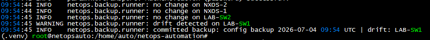

# netops-automation

Network automation for multi-vendor labs and internal networks. Four tools on one inventory and connection layer: config backup and drift detection, pre and post change validation, STIG compliance auditing, and IPAM source-of-truth sync.

Live writeup → https://archieabeleda.github.io/netops-automation/


## What this is

A working toolkit that logs into network devices over SSH and does four jobs. It backs up running configs to git and flags drift, snapshots network state before and after a change to catch dropped adjacencies, audits devices against a rule set and pushes fixes when told to, and syncs live IP and MAC allocations into NetBox. Connections go through Netmiko, so any platform Netmiko supports works with the same code. The examples target Cisco IOS and NX-OS, built and validated in an EVE-NG lab.


## What this isn't

A turnkey product. It is a lab and portfolio project that shows a way to build read-only-first network automation with human gates on anything that changes a device. The tools that write are dry runs by default and act only when you add `--apply`. Point it at production only behind a service account and a change process.


## Architecture

```
src/netops/
  settings.py          config from environment, credentials never in the repo
  inventory.py         one YAML file, validated on load
  connections.py       single Netmiko context manager used by every tool
  cli.py               Typer entry point, one command group per tool
  backup/              pull config, strip volatile lines, difflib drift, git push
  compliance/          declarative rules, read-only audit, gated remediation
  prepost/             snapshot state, compare before and after
  ipam/                ARP discovery, NetBox sync
```


## Quickstart

```bash
git clone https://github.com/ctrlf4rchie/netops-automation
cd netops-automation
python3 -m venv .venv && source .venv/bin/activate
pip install -e ".[dev]"

cp .env.example .env                                       # set credentials
cp inventory/devices.example.yaml inventory/devices.yaml   # list devices

netops backup run --no-push     # safe local run, reads devices, changes nothing
netops compliance audit         # report violations, changes nothing
```


## Example: drift detection




## Safety

The tools that change device or record state are read-only until you opt in. `compliance remediate` and `ipam sync` are dry runs by default and print what they would do. Add `--apply` to act. Run remediation against a lab first and read the diff before production.


## Appendix A: Command quick reference

```bash
# setup, done once
python3 -m venv .venv
source .venv/bin/activate            # activate every new terminal
pip install -e ".[dev]"
netops --help                        # confirm it installed
pytest -q                            # run offline tests

# configuration, edit these files
cp .env.example .env                 # then set credentials, chmod 600 .env
cp inventory/devices.example.yaml inventory/devices.yaml   # then list devices

# backup and drift
netops backup run --no-push          # local only, safe first run
netops backup run                    # commit and push to the private repo
netops backup schedule --at 02:00    # simple built-in scheduler

# compliance
netops compliance audit              # read-only, reports violations
netops compliance remediate          # dry run, prints the fix, changes nothing
netops compliance remediate --apply  # pushes the fix (lab first)

# pre and post change
netops prepost snapshot pre          # before the change
netops prepost snapshot post         # after the change
netops prepost compare pre post      # report what broke

# ipam
netops ipam sync                     # preview discovered addresses
netops ipam sync --apply             # write to NetBox
```


## Appendix B: Glossary

**Control node.** The one computer that runs the toolkit and reaches out to the devices.

**SSH.** Secure Shell. An encrypted way to log into a device remotely and run commands. Uses TCP port 22.

**Running-config.** The live configuration a device is currently using. The backup tool copies this.

**Virtual environment (venv).** A private, isolated copy of Python for one project, so its libraries do not clash with anything else on the machine.

**pip.** Python's package installer. It downloads and installs libraries.

**Environment variable.** A setting the program reads from its surroundings rather than from code. Here they start with `NETOPS_` and live in the `.env` file.

**Inventory.** The list of devices the toolkit manages, in a YAML file.

**Netmiko device_type.** A short string like `cisco_ios` that tells the toolkit what kind of device it is talking to, so it uses the right commands.

**git.** A version control system that tracks changes to files over time.

**Remote.** The address of a git repository stored elsewhere, like on GitHub, that you push your local commits to.

**Commit.** A saved snapshot of changes in git, with a message describing it.

**Push.** Sending your local commits to the remote repository.

**Drift.** A change in a device's config compared to the last time it was captured. The tool detects this by comparing configs line by line.

**Regular expression (regex).** A compact way to describe a text pattern, used by the compliance rules to search configs.

**STIG.** Security Technical Implementation Guide. A published set of security requirements for a system. The compliance rules are modeled on this idea.

**Remediation.** Automatically pushing the config that fixes a compliance failure.

**Dry run.** Running a tool so it shows what it would do without actually doing it. Your safety net.

**BGP neighbor (adjacency).** A routing relationship between two devices. If one disappears after a change, routes can be lost.

**Prefix.** A block of IP addresses a router knows a path to.

**Snapshot.** A saved capture of network state at one moment, used by pre and post validation.

**Source of truth.** The system that is treated as the authoritative record, here NetBox for IP allocations.

**NetBox.** A database and web app for documenting networks, including IP address management.

**systemd.** The Linux service and timer manager, used to run the backup automatically and reliably.

**cron.** An older Linux scheduler that runs commands at set times.


## License

MIT. See LICENSE.

---

Built by Archie Abeleda · CISSP · CCSP · CCNP Security · PCNSE
[archieabeleda.dev](https://archieabeleda.dev) · [GitHub](https://github.com/archieabeleda) · [LinkedIn](https://linkedin.com/in/ajrabeleda)
